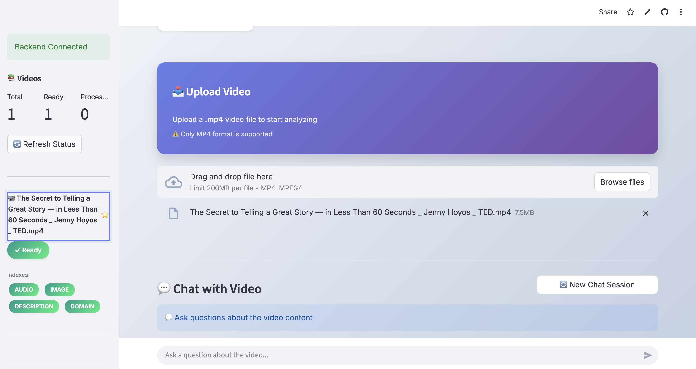
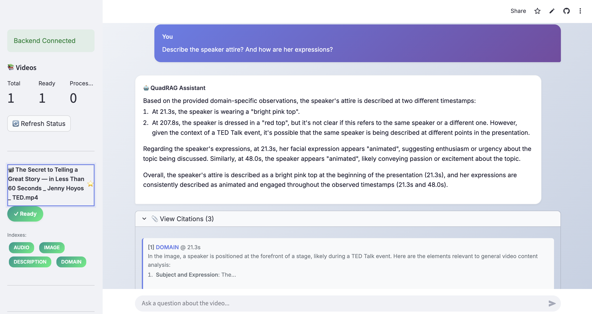

# 🎬 QuadRAG: Four-Index Multimodal RAG for Video Understanding

<div align="center">

[](https://www.python.org/)
[](https://fastapi.tiangolo.com/)
[](https://streamlit.io/)
[](LICENSE)

**A training-free multimodal video comprehension system that uses four parallel semantic indexes for rich, context-aware question answering about video content.**

[🎥 **Live Demo**](https://sanjayrag.streamlit.app/) •
[📖 **Dataset**](https://drive.google.com/drive/folders/137n7bzC6G31L7hohG8WWN6T8-4JsiarW?usp=drive_link)

---

### ✨ **Step-by-Step UI Screenshots**

| **Step 1: Domain Context Setup** | **Step 2: Video Upload** | **Step 3: Processing** | **Step 4: Question Answering** |
|:--------------------------------:|:------------------------:|:----------------------:|:------------------------------:|
|  |  |  |  |

*Click images to view full-size screenshots*

---

</div>

## 🚀 **Key Features**

### 🎯 **Four Semantic Indexes**
- **🎬 Image Index**: Raw video frames with CLIP embeddings for visual search
- **🎵 Audio Index**: Transcribed spoken dialogue with semantic embeddings
- **📝 Description Index**: AI-generated frame descriptions with text embeddings
- **🎭 Domain Index**: Context-specific captions based on user-defined domain focus

### ⚡ **Advanced Capabilities**
- 🔄 **Dynamic Domain Captioning**: Generate domain-specific content on-the-fly
- 🧠 **Intelligent Fusion**: Weighted retrieval across all four indexes
- 📊 **Resource Monitoring**: CPU, memory, and processing time tracking
- 🔧 **Adaptive Processing**: Frame sampling based on video duration
- 🛡️ **Thread Isolation**: Stable async processing with event loop protection
- 📱 **Responsive UI**: Modern Streamlit interface with real-time status

### 🎨 **User Experience**
- 💬 Conversational Q&A interface
- 📈 Real-time processing status with progress indicators
- 🔄 Re-processing capability for failed index creation
- 📋 Citation tracking for answer provenance
- 🎭 Domain context customization per session

## 🏗️ **Architecture**

```
┌─────────────────────────────────────────────────────────────┐
│                     Streamlit Frontend                       │
│  ┌──────────────┐  ┌──────────────┐  ┌──────────────┐      │
│  │ Domain       │  │ Video        │  │ Chat         │      │
│  │ Context      │  │ Upload       │  │ Interface    │      │
│  └──────────────┘  └──────────────┘  └──────────────┘      │
└─────────────────────────────────────────────────────────────┘
                            │
                            │ HTTP API
                            ▼
┌─────────────────────────────────────────────────────────────┐
│                      FastAPI Backend                         │
│  ┌──────────────────────────────────────────────────────┐   │
│  │              Video Processing Pipeline               │   │
│  │  ┌─────────┐  ┌─────────┐  ┌─────────┐  ┌─────────┐│   │
│  │  │ Extract │→ │ Process │→ │ Create  │→ │  Store  ││   │
│  │  │ Frames  │  │ Audio   │  │ Indexes │  │  Index  ││   │
│  │  └─────────┘  └─────────┘  └─────────┘  └─────────┘│   │
│  └──────────────────────────────────────────────────────┘   │
│  ┌──────────────────────────────────────────────────────┐   │
│  │              Four Semantic Indexes                   │   │
│  │  ┌─────────┐  ┌─────────┐  ┌─────────┐  ┌─────────┐│   │
│  │  │  Image  │  │  Audio  │  │  Desc   │  │ Domain  ││   │
│  │  │  Index  │  │  Index  │  │  Index  │  │ Index   ││   │
│  │  │  CLIP   │  │ Gemini  │  │ OpenAI  │  │ OpenAI  ││   │
│  │  └─────────┘  └─────────┘  └─────────┘  └─────────┘│   │
│  └──────────────────────────────────────────────────────┘   │
│  ┌──────────────────────────────────────────────────────┐   │
│  │              RAG Pipeline                            │   │
│  │  ┌─────────┐  ┌─────────┐  ┌─────────┐  ┌─────────┐│   │
│  │  │ Search  │→ │  Fuse   │→ │Generate │→ │ Return  ││   │
│  │  │ Indexes │  │ Results │  │  with   │  │ Answer  ││   │
│  │  │         │  │         │  │  Groq   │  │         ││   │
│  │  └─────────┘  └─────────┘  └─────────┘  └─────────┘│   │
│  └──────────────────────────────────────────────────────┘   │
└─────────────────────────────────────────────────────────────┘
                            │
                            ▼
┌─────────────────────────────────────────────────────────────┐
│                    Pixeltable Storage                        │
│  ┌──────────────────────────────────────────────────────┐   │
│  │              PostgreSQL + pgvector                   │   │
│  │  ┌─────────┐  ┌─────────┐  ┌─────────┐  ┌─────────┐│   │
│  │  │  Frames │  │ Audio   │  │  Desc   │  │ Domain  ││   │
│  │  │  + CLIP │  │ Chunks  │  │  Embed  │  │ Captions││   │
│  │  │ Embed   │  │ + Text  │  │         │  │         ││   │
│  │  └─────────┘  └─────────┘  └─────────┘  └─────────┘│   │
│  └──────────────────────────────────────────────────────┘   │
└─────────────────────────────────────────────────────────────┘
```

## 🛠️ **Technology Stack**

| **Category** | **Technology** | **Purpose** |
|-------------|---------------|-------------|
| **AI/ML** | Groq (Llama 4 Scout/Maverick) | Conversational Q&A generation |
| | OpenAI GPT-4o-mini | Image descriptions & domain captions |
| | OpenAI text-embedding-3-small | Text embeddings |
| | CLIP (openai/clip-vit-base-patch32) | Image embeddings |
| **Vector DB** | Pixeltable + PostgreSQL + pgvector | Multimodal vector storage & retrieval |
| **Backend** | FastAPI + Uvicorn | REST API with async processing |
| **Frontend** | Streamlit | Interactive web UI |
| **Video Processing** | FFmpeg + OpenCV | Frame extraction & audio processing |
| **Audio** | Whisper-1 | Speech-to-text transcription |
| **Deployment** | Railway (Nixpacks) | Cloud hosting with auto-scaling |

## 📋 **Prerequisites**

- **Python**: 3.10 or higher
- **API Keys**: Groq, OpenAI, and Google AI (optional)
- **Storage**: 2GB+ free disk space for video processing
- **Memory**: 8GB+ RAM recommended for large videos

## 🚀 **Quick Start**

### **Option 1: One-Command Setup (Recommended)**

```bash
# Clone and setup everything
git clone https://github.com/sannzay/Video-RAG_DL_Project.git
cd QuadRAG
./setup_env.sh  # Sets up Python environment and dependencies
```

### **Option 2: Manual Setup**

```bash
# 1. Clone the repository
git clone https://github.com/sannzay/Video-RAG_DL_Project.git
cd QuadRAG

# 2. Set up Python environment
python3 -m venv venv
source venv/bin/activate  # On Windows: venv\Scripts\activate

# 3. Install dependencies
pip install -r backend/requirements.txt
pip install -r frontend/requirements.txt

# 4. Configure API keys
cp .env.example .env
# Edit .env with your API keys
```

### **Option 3: Railway Deployment (Cloud)**

[](https://railway.app/template/XXXXXX)

1. Connect your GitHub repository to Railway
2. Set environment variables in Railway dashboard:
   ```
   GROQ_API_KEY=your_groq_key
   OPENAI_API_KEY=your_openai_key
   GOOGLE_API_KEY=your_google_key
   ```
3. Deploy automatically on every push

## 🎯 **Usage Guide**

### **Step 1: Start the Application**

```bash
# Start backend API (in one terminal)
./start_backend.sh

# Start frontend UI (in another terminal)
./start_frontend.sh
```

Or for Railway deployment, the app starts automatically.

### **Step 2: Access the Interface**

- **Local**: Open http://localhost:8501
- **Railway**: Use your Railway deployment URL

### **Step 3: Configure Domain Context**

Set your domain focus for intelligent video understanding:
- *"Capture emotions and facial expressions"*
- *"Focus on technical demonstrations and tutorials"*
- *"Analyze dialogue and conversation patterns"*
- *"Track object interactions and movements"*

### **Step 4: Upload & Process Video**

1. **Upload**: Drag & drop MP4 files (up to 500MB, 2 hours)
2. **Process**: Watch real-time progress across four indexes
3. **Monitor**: View CPU/memory usage and processing times

### **Step 5: Ask Questions**

Get comprehensive answers with citations:
- *"What emotions are shown in the video?"*
- *"Describe the main activities happening"*
- *"What technical concepts are demonstrated?"*

## 📁 **Project Structure**

```
QuadRAG/
├── 📁 backend/                          # FastAPI backend
│   ├── 📄 api.py                        # Main API application
│   ├── 📄 pyproject.toml                # Backend dependencies
│   └── 📁 src/quadrag/                  # Core modules
│       ├── 📄 config.py                 # Application settings
│       ├── 📄 models.py                 # Pydantic data models
│       ├── 📄 utils.py                  # Utility functions
│       ├── 📁 video/                    # Video processing
│       │   ├── 📄 processor.py          # Video ingestion
│       │   ├── 📄 indexer.py            # Index creation
│       │   └── 📄 registry.py           # Video metadata storage
│       ├── 📁 retrieval/                # Search & retrieval
│       │   ├── 📄 search_engine.py      # Multi-index search
│       │   └── 📄 fusion.py             # Result fusion
│       └── 📁 generation/               # RAG generation
│           └── 📄 rag_generator.py      # LLM-powered Q&A
├── 📁 frontend/                         # Streamlit UI
│   ├── 📄 app.py                        # Main application
│   └── 📄 requirements.txt              # Frontend dependencies
├── 📁 data/                             # Data storage
│   ├── 📁 videos/                       # Uploaded video files
│   └── 📁 cache/                        # Pixeltable cache
├── 📄 railway.toml                     # Railway deployment config
├── 📄 nixpacks.toml                    # Nixpacks build config
├── 📄 start_backend.sh                 # Backend startup script
├── 📄 start_frontend.sh                # Frontend startup script
└── 📄 README.md                        # This file
```

## ⚙️ **Configuration**

### **Environment Variables**

| Variable | Required | Description |
|----------|----------|-------------|
| `GROQ_API_KEY` | ✅ | Groq API key for conversational AI |
| `OPENAI_API_KEY` | ✅ | OpenAI API key for vision and embeddings |
| `GOOGLE_API_KEY` | ❌ | Google AI API key (optional fallback) |
| `QUADRAG_API_URL` | ❌ | Custom API URL (for local development) |
| `PORT` | ❌ | Server port (Railway sets automatically) |

### **Processing Configuration**

| Setting | Default | Description |
|---------|---------|-------------|
| `SPLIT_FRAMES_COUNT` | 45 | Number of frames to extract (adaptive) |
| `AUDIO_CHUNK_LENGTH` | 10s | Audio chunk duration |
| `MAX_VIDEO_SIZE_MB` | 500 | Maximum video file size |
| `MAX_DURATION_SECONDS` | 7200 | Maximum video duration (2 hours) |

## 🔧 **Development**

### **Running Tests**

```bash
# Backend API tests
cd backend
python -m pytest tests/

# Video processing tests
python test_video_processing.py

# Search functionality tests
python test_search_engine.py
```

### **Local Development Setup**

```bash
# Start backend in development mode
cd backend
uvicorn api:app --reload --host 0.0.0.0 --port 8000

# Start frontend in another terminal
cd frontend
streamlit run app.py --server.port 8501 --server.address 0.0.0.0
```

### **Contributing**

1. Fork the repository
2. Create a feature branch: `git checkout -b feature-name`
3. Make your changes and add tests
4. Run tests: `python -m pytest`
5. Commit: `git commit -m "Add feature"`
6. Push: `git push origin feature-name`
7. Create a Pull Request

## 📊 **Performance & Limitations**

### **Processing Times** (Approximate)
- **Short videos** (< 5 min): 2-5 minutes
- **Medium videos** (5-30 min): 5-15 minutes
- **Long videos** (30-120 min): 15-45 minutes

### **Resource Requirements**
- **CPU**: Multi-core recommended for parallel processing
- **RAM**: 8GB+ for optimal performance
- **Storage**: 2-10GB per hour of video content

### **Current Limitations**
- MP4 format support (H.264 recommended)
- English language audio transcription
- API rate limits for vision models
- Maximum 2-hour video duration

## 🐛 **Troubleshooting**

### **Common Issues**

**❌ "IndexError: pop from an empty deque"**
- **Cause**: Asyncio event loop corruption
- **Solution**: Thread isolation implemented (no action needed)

**❌ "Video processing timeout"**
- **Cause**: Large video files or slow network
- **Solution**: Reduce video size or increase Railway plan

**❌ "API key not configured"**
- **Cause**: Missing environment variables
- **Solution**: Set API keys in Railway dashboard or `.env` file

### **Debug Mode**

```bash
# Enable detailed logging
export QUADRAG_LOG_LEVEL=DEBUG

# Start with debug output
./start_backend.sh
```


## 🤝 **Contributing**

We welcome contributions!

### **Development Setup**

```bash
# Install development dependencies
pip install -r requirements-dev.txt

# Run tests
pytest

# Check code quality
black . --check
isort . --check-only
flake8
```

## 📄 **License**

This project is licensed under the **MIT License** - see the [LICENSE](LICENSE) file for details.

## 🙏 **Acknowledgments**

- **Pixeltable** for the excellent vector database framework
- **Groq** for fast LLM inference
- **OpenAI** for vision and embedding models
- **Streamlit** for the amazing UI framework
- **Railway** for cloud deployment infrastructure

## 📞 **Support**

- **📧 Email**: [sannzayreddy@gmail.com](mailto:sannzayreddy@gmail.com)
- **🐛 Issues**: [GitHub Issues](https://github.com/sannzay/Video-RAG_DL_Project/issues)
- **💬 Discussions**: [GitHub Discussions](https://github.com/sannzay/Video-RAG_DL_Project/discussions)

---

<div align="center">

**Made with ❤️ for multimodal video understanding**

[⭐ Star us on GitHub](https://github.com/sannzay/Video-RAG_DL_Project) •
[🎥 Watch Demo](https://sanjayrag.streamlit.app/)

</div>

---

*Last updated: December 2025*
